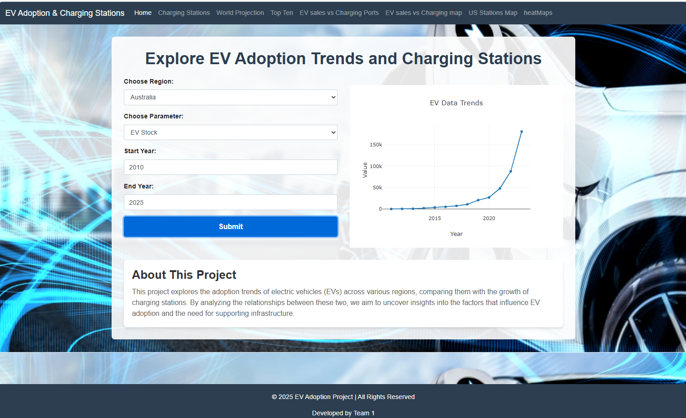
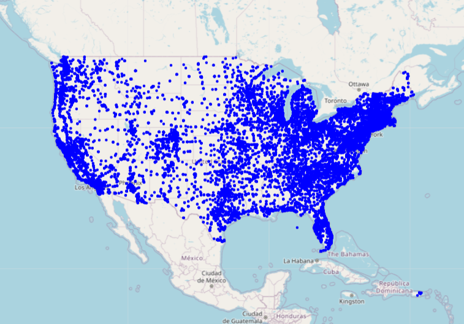
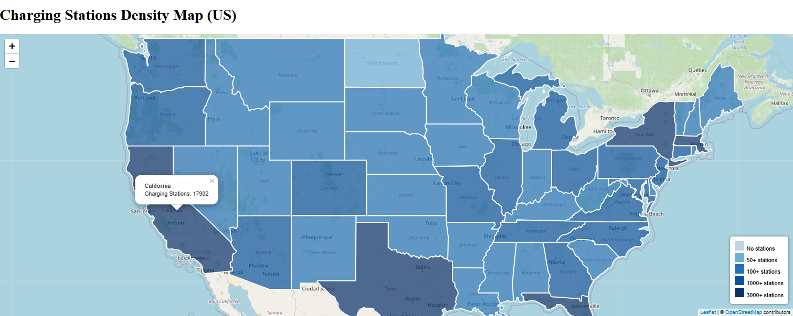
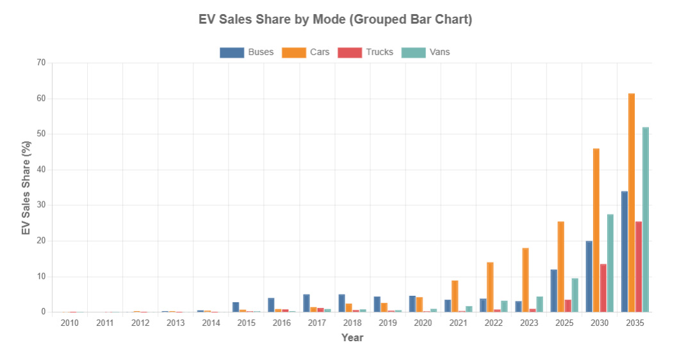
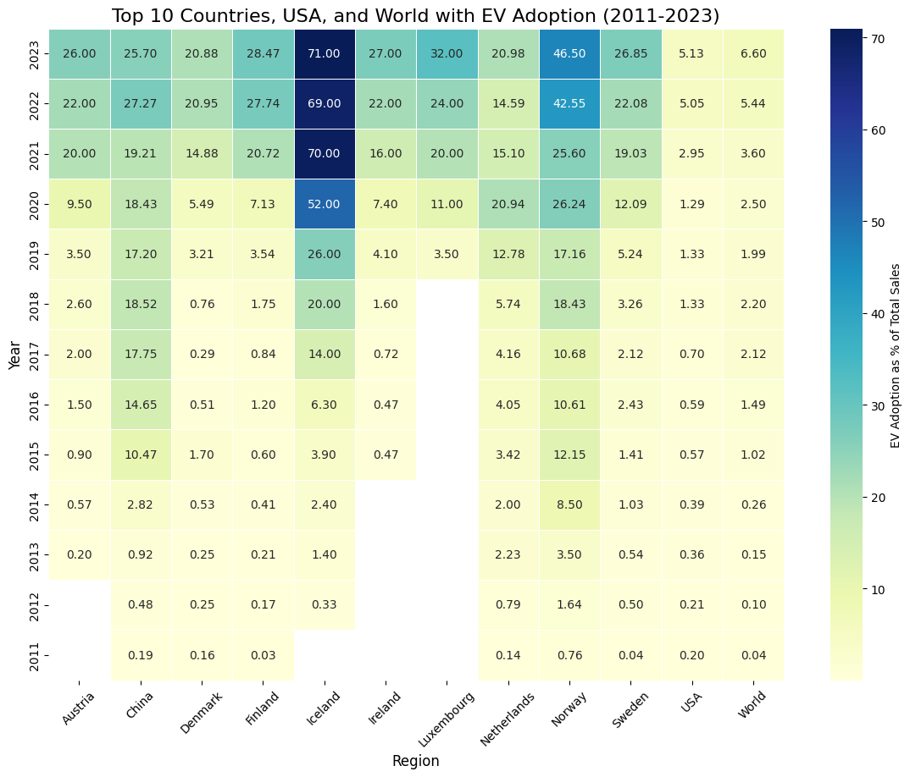

# Data Analytics Project 3: Electric Vehicle Adoption & Charging Stations

## Overview

This project focuses on analyzing trends in electric vehicle (EV) adoption globally and the availability of EV charging stations in the United States. Using data from the **IEA Global EV Outlook Report** and **OpenEVSE Charging Station Data**, we provide insights through interactive visualizations and analysis. The project combines Python, JavaScript, SQL (PostgreSQL), and Leaflet for creating insightful and interactive maps and charts.

## Folder Structure

```
/final_files_proj3
    ├── /templates
    ├── /static
    ├── /datasets
    ├── app.py
    └── dataset_analysis_visualizations.ipynb
```


- **final_files_proj3/**: Contains all project files, including code, datasets, and visualization outputs.
  - **datasets/**: Includes the raw datasets used in the project.
  - **static/**: Stores static files for visualization.
  - **templates/**: Flask template files for rendering HTML.
  - **app.py/**: Main Flask app file that initializes the app and handles routing.
  - **dataset_analysis_visualizations.ipynb/**:Jupyter notebook used for cleaning the datasets, performing exploratory data analysis (EDA), and generating visualizations to uncover insights related to electric vehicles and charging infrastructure.

## Datasets Used

This project leverages the following datasets to analyze and visualize electric vehicle adoption trends and charging stations:

1. **Global EV Outlook Report**: This dataset includes global statistics on electric vehicle adoption, trends, and policies. It provides insights into how the market is evolving in different regions.
   
2. **OpenEVSE Charging Station Data**: This dataset contains information on electric vehicle charging stations in the USA, including their locations and availability.

Both datasets are integral to the project's goal of exploring regional adoption trends and the impact of charging infrastructure.
## Methodology
- **Data Collection**: Data will be collected from publicly available datasets such as the IEA's "Global EV Outlook" and OpenEVSE charging stations dataset.
  
- **Data Preparation and Cleaning**: We will process and clean the data, checking for missing values and ensuring consistency across different datasets.

- **Exploratory Data Analysis (EDA)**: Using Python libraries (Pandas, Matplotlib)(chart.js), we will explore the data for patterns, trends, and correlations between EV adoption and charging stations.

- **Data Visualization**: Interactive visualizations(maps,heatmaps) will be created using Leaflet and Matplotlib to present insights, such as regional EV adoption rates and the distribution of charging stations.


## Tools and Technologies
- **Programming Languages**: Python (for data processing, analysis, and visualization)
- **Libraries**: Pandas, Matplotlib, Leaflet, Plotly
In addition to the libraries covered in class, this project also utilizes **Chart.js**, a JavaScript library for creating interactive charts. Chart.js was chosen for its flexibility and ease of integration with HTML and JavaScript to create responsive, visually appealing charts. The library enhances the project's visualizations by providing smooth animations and dynamic updates for the displayed data.
- **Database**: PostgreSQL (to store and query the datasets)
- **Web Framework**: Flask (for building the API and rendering visualizations)

## Deliverables
- **Interactive Visualization**: A dashboard that provides interactive views of the data, including maps of charging station distribution and EV adoption trends.
- **Project Documentation**: A comprehensive README file detailing the project, methodology, and ethical considerations.

## Visualizations
### Dashboard


### Density Map for charging stations across USA


### Density Map for charging stations using geojson across USA


### EV Adoption Trends Over Time


### Charging Stations Heatmap


## Ethical Considerations
Throughout the development of this project, we have considered the ethical implications of data usage, particularly concerning privacy and accessibility. We have used open-source datasets that are publicly available and ensured that all data processing and visualization are transparent and reproducible. No sensitive or personal data has been used, and our visualizations aim to make complex data more accessible to a broad audience.
We also considered the ethical impact of presenting accurate, non-misleading insights, ensuring that the visualizations provide clear, digestible information for users of all skill levels.

## Conclusion
The analysis of electric vehicle adoption trends has revealed significant global growth, particularly in regions like china, Europe, and USA. The adoption is closely linked to factors such as government policies, incentives, and local market conditions. Additionally, the availability of charging infrastructure plays a key role, with some areas facing challenges in maintaining a balanced ratio of charging stations to electric vehicles. Overall, the project successfully illustrates these trends, providing valuable insights into the future trajectory of electric vehicle adoption and the associated infrastructure requirements.

## **Setting Up and Running the Project**

### **1. Set Up the Database**  
- **Using pgAdmin**:  
  1. Create a new database (e.g., `ev_adoption`).
  2. Open the **Query Tool** and load the `ev_schema.sql` file.
  3. Execute the schema file to create the necessary tables.

### **2. Import Data**  
- **Using pgAdmin**:  
  1. Right-click the **table** you want to import data into → **Import/Export Data**.
  2. Select the appropriate CSV file for each dataset.
  3. Ensure the **serial primary key** column is unchecked (this will auto-generate the values).
  4. Click **OK** to import the data.

### **3. Install Dependencies**  
Ensure you have all necessary Python libraries installed. Open the `requirements.txt` file and install them using your Python IDE or editor.

### **4. Run the Flask App**  
1. Open your Python IDE (e.g., PyCharm, VS Code).
2. Open the `app.py` file in the final_files_proj3 folder.
3. Run the file, and the Flask server will start.
4. Open a browser and go to:  
http://127.0.0.1:5000

## Contributors
- [**@arkhanks**](https://github.com/arkhanks) (Amy)
- [**@nitubola88**](https://github.com/nitubola88) (Nitu)
- [**@Ma-shiki2024**](https://github.com/Ma-shiki2024) (Shiki)
- [**@Zelyd**](https://github.com/Zelyd) (Niczely)
